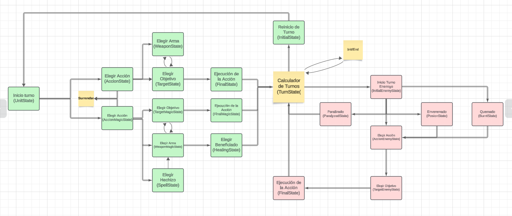

# Final Reality

## Introduction

Final Reality is a simplified version of the popular game Final Fantasy. Its main objective is to serve as an educational tool designed to teach fundamental programming concepts.

## Design Decisions

### Characters and Enemies

#### Abstract Classes:
Abstract classes are used to represent characters and enemies, allowing code reuse and flexibility to define specific behaviors in subclasses.

The class diagram shows the hierarchy of classes for characters and enemies:
The 'Playable' trait defines useful getters and setters for future implementations.

[Playable] --> A[APlayable] | The abstract class 'APlayable' implements the trait methods and defines new methods specific to character development and actions in the game, such as attacking, being attacked, etc.

A[APlayable] --> B{Paladin} | A 'Paladin' is defined as the simplest character in the game, with balanced attributes, favored by beginners.

A --> C{Warrior} | A 'Warrior' is known as the tank, with high health, slow but very strong, and can be a great ally in the right context.

A --> D{Ninja} | The 'Ninja' is favored by game enthusiasts, appearing weak and less useful, but only those who understand its attributes can master it.

A --> E{BlackMage} | The 'Black Mage' is a magically specialized attacking character, fast and with high mana.

A --> F{WhiteMage} | The 'White Mage' is magically focused on defense, with high health and defense.

The 'NonPlayable' trait defines useful getters and setters for future implementations.

[NonPlayable] --> G[ANonPlayable] | The abstract class 'ANonPlayable' implements the trait methods and defines new methods specific to enemy development and actions in the game, such as attacking, being attacked, etc.

G[ANonPlayable] --> H{Enemy} | An 'Enemy' is an object in the game representing the adversary that our characters must defeat.

#### Character Types:
Characters are divided into different classes (Paladin, Warrior, Ninja, Black Mage, White Mage) to reflect their different abilities and attributes in the game. Each class has its own unique characteristics, such as health points, attack, defense, and mana (for magic users).

#### Enemies:
Enemies are modeled as a separate class due to their unique characteristics and behaviors compared to player-controlled characters. Enemies have their own attributes, such as health points, attack, defense, and attack behaviors.

#### Weapons

#### Abstract and Concrete Classes:
Abstract and concrete classes were implemented to represent common and magical weapons. The class diagram shows the hierarchy of classes for weapons:
[NonPlayable] --> A[AWeapon] | The abstract class 'AWeapon' implements trait methods and adds new ones useful for each weapon.

A[AWeapon] -->

A --> B{Sword} | 'Sword' is the most balanced weapon in the game in terms of attack-weight ratio.

A --> C{Axe} | 'Axe' is a heavy but powerful weapon.

A --> D{Bow} | 'Bow' is a lightweight and less powerful weapon.

A --> E{Staff} | 'Staff' is a heavier, powerful weapon that magic users can wield.

A --> F{Wand} | 'Wand' is the opposite of the staff, a fast weapon with less damage but can be very useful for a skilled magic user.

#### Weapon Attributes:
Each weapon has attributes such as name, attack points, weight, and a possible owner, reflecting the game rules on weapon equipment by characters. Common weapons have basic attributes, while magical weapons have additional attributes like magic power and type of magic.

### Code Structure

The code is organized into packages for better modularity and readability:

#### Model Package:
Contains classes representing game elements such as characters, enemies, and weapons.

#### Controller Package:
Contains classes that control the game flow, such as turn management and battle.

#### Test Package:
Contains unit tests to verify the correct functioning of the code.

### Design Patterns Used

#### Inheritance:
Used to model the relationship between abstract and concrete classes, allowing code reuse and behavior specialization.

#### State:
Used to model the relationship between all units in the game.

#### Traits:
Used to define common functionalities that can be shared among multiple classes, promoting code reuse and modularity.

### Conclusion

Final Reality is an educational project that uses programming concepts to create a simplified game. The organization of code into packages and the use of design patterns such as inheritance and traits make the code modular, readable, and easy to maintain.
This project is licensed under the
[Creative Commons Attribution 4.0 International License](https://creativecommons.org/licenses/by/4.0/).
