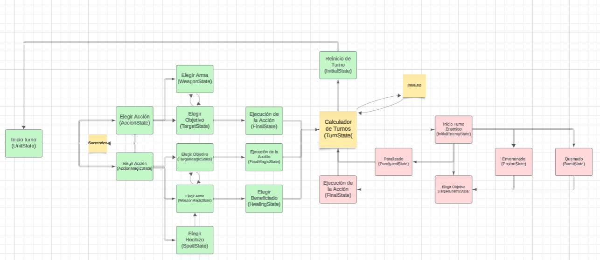

# Final Reality
## Introduction

Final Reality is a simplified version of the popular game Final Fantasy. Its main objective is to serve as an educational tool designed to teach fundamental programming concepts. It is a video game whose code tests concepts related to object-oriented programming (OOP), such as Testing, Classes, Traits, Inheritance, Abstract Classes, Overriding, Liskov, Exceptions, Double Dispatch, Design Patterns, and Pattern Matching.

## Design Decisions-Model

### Traits

#### The Game Unit Trait:
This trait aggregates the behavior of entities in this game. Some of the most relevant methods are: getName, getHp, getWeight, setHp, etc. Since many of these methods are common for allies and enemies, it made sense to create this Scala interface. Additionally, as detailed later, the data structures with which the controller interacts with the characters are "mixed," meaning they (should) receive both classes of entities.

#### The Playable Trait:
This trait maintains cohesion among the different types of characters (Paladin, Ninja, Warrior, White Mage, Black Mage) but separates some behaviors and/or methods from the enemies. This step is crucial because we will later need to use this trait as a type to discern the type of entity we are using in the game (the controller actually does this on its own :)).

##### The MagicPlayable Trait:
Just to use "MagicPlayable" as a type if we needed it.

#### The NonPlayable Trait:
This trait clearly complements the previous one. Together, they seek to cover all the functionalities that an entity can have in the game, considered a GameUnit. Some of the most relevant methods are: SetStatus (reflects the effect of spells), getAttack (delivers the enemy's attack points), getWeight (key to calculating the enemy's turn), among others.

#### The Weapon Trait:
This trait is used to represent a weapon in the game environment. Among the most notable methods are: getWeight, getAttack, getOwner, setOwner, etc.

#### The Spell Trait:
This represents spells within the game. Establishing a proper interface is key to better interacting with the mages and the enemies who will suffer the effects.

### Abstract Classes:
Abstract classes are used to represent characters and enemies, allowing code reuse and flexibility to define specific behaviors in subclasses. There are two in the case of characters and one in the case of enemies.

#### APlayable
This class implements all the functionality that a player in the game can/must have (based on the demands of its trait). Here are the specifications of crucial methods such as: attack (specifies the series of steps to successfully attack an enemy), wasAttacked (indicates how a player responds to a certain enemy attack), and some auxiliary methods that, through the technique of double dispatch, allow us to know the class of the character we are using (Style, IAmCommon, IAmMagic, etc.).

#### AEnemy
Similar to the traits, this abstract class is nothing more than the complement of the previous one, which implements the necessary specifications for the proper functioning of the enemy and its interaction with other entities/classes/objects in the game.

#### AMagicPlayable
The second abstract class for characters refers to the magical characters. It basically takes the methods of APlayable (actually from the Trait) and 'adapts' them to the functionalities that a mage must have, such as having Mana, having Spells, attacking, attacking with spells, healing with spells, etc.

#### AWeapon
Here, the aforementioned methods are implemented, providing functionality to the objects that extend from it.

#### ACommonWeapon and AMagicWeapon:
Just as there are 2 types of characters, there are 2 types of weapons. Each has its own abstract classes, which detail certain extra specifications for the proper functioning of the game.

#### ASpell:
Various defaults are established, such as the probability of causing an effect, knowing whether it can act on an enemy/ally, and obtaining the owner of that spell.

### Classes:
#### Paladin:
A class to represent a paladin in the game. This will be a "normal" and balanced character type, versatile without too much health, attack, or shield.

#### Ninja:
Aims to be a very fast character. Its weight depends almost entirely on the weapon it carries, making it very lethal in certain situations.

#### Warrior:
The tank of the game, with a lot of health, very heavy, and a bit grumpy, haha.

#### White Magician:
The healer of the group, a key support character in long duels. Not very interested in attacking, although they can wield quite powerful spells like poison. Their participation in the battle is usually more focused on helping their teammates.

#### Black Magician:
An absolute executioner, mercilessly seeking to torment their enemies. Very strong, fast, and full of Mana to cast powerful spells.

#### Enemy:
The class that creates enemy objects. These are quite balanced and are notable for having "low" attack points relative to their weight. However, this deficit is compensated by their ridiculously high amount of Health and Shield, making them formidable entities in long games.

#### Bow:
A light weapon selectable by White Mages, Ninjas, and Warriors.

#### Sword:
A powerful weapon selectable by Black Mages, Paladins, and Warriors.

#### Axe:
A mid-level weapon selectable by Paladins and Warriors.

#### Wand:
A light magical weapon selectable by White and Black Mages.

#### Staff:
A heavy magical weapon selectable by White and Black Mages.

#### Healing:
A Light-type spell, selectable only by the White Mage, heals allies up to 30% of their maximum health.

#### Paralysis:
A Light-type spell, selectable only by the White Mage, paralyzes enemies for one turn.

#### Poison:
A Light-type spell, selectable only by the White Mage, poisons enemies, causing them to suffer for 4 turns.

#### Fire:
A Dark-type spell, selectable only by the Black Mage, reduces health based on the caster's AP and burns enemies (with a 20% probability), causing them to suffer for 4 turns.

#### Thunder:
A Dark-type spell, selectable only by the Black Mage, reduces health based on the caster's AP and paralyzes enemies (with a 30% probability), causing them to suffer for 4 turns.

## Design Decisions-General:
### Party:
It has a trait to be used as a type and a concrete class that implements the necessary features. It is the data structure that contains the allies in the game.

### TurnSchedule:
It has a trait to be used as a type and a concrete class that implements the necessary features. It is the data structure responsible for assigning turns to the participants in a battle, one of the fundamental components of the controller.

### GameModel:
Here lies the key to the game itself. Allies, enemies, weapons, and their characteristics are established here. The game's difficulty is defined from here.

### BattleGame:
Here, some controller methods are connected through the `run` method to "start" the game.

## Design Decisions-View:

#### Controller Package:
Contains classes that control the game flow, such as turn management and battle.

#### Test Package:
Contains unit tests to verify the correct functioning of the code.

### Design Patterns Used

#### Inheritance:
Used to model the relationship between abstract and concrete classes, allowing code reuse and behavior specialization.

#### Traits:
Used to define common functionalities that can be shared among multiple classes, promoting code reuse and modularity.

### Conclusion

Final Reality is an educational project that uses programming concepts to create a simplified game. The organization of code into packages and the use of design patterns such as inheritance and traits make the code modular, readable, and easy to maintain.
This project is licensed under the
[Creative Commons Attribution 4.0 International License](https://creativecommons.org/licenses/by/4.0/).